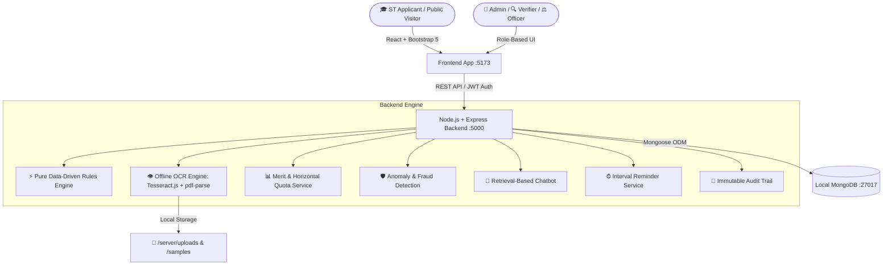

# 🏛️ AI-Enabled Scholarship & Fellowship Management System for Scheduled Tribes
### Smart India Hackathon (SIH) Problem Statement 26239 | Ministry of Tribal Affairs (MoTA), Government of India
> **Empowering Scheduled Tribe Scholars through AI-Assisted Transparent Governance**

---

## 🌟 Executive Summary

The **Ministry of Tribal Affairs (MoTA)** administers flagship higher education and research fellowships for Scheduled Tribe (ST) students across India and abroad:
- **National Fellowship for Scheduled Tribes (NFST)**: Supporting M.Phil & Ph.D. research in Indian Universities (750+ seats, ₹32,000/mo JRF stipend).
- **National Overseas Scholarship (NOS)**: Supporting Master's & Ph.D. studies in top foreign institutions abroad (100 seats, full tuition + living allowance).

### 🎯 Key Challenges Solved
1. **Manual Verification Delay**: Offline OCR automatically classifies certificates, extracts text attributes (income, caste, roll number, dates), and flags discrepancies in seconds.
2. **Hardcoded Rules Problem**: Scheme eligibility rules are stored as **data** in MongoDB. Ministry Admins can update income thresholds, mark criteria, or age limits with zero code deployments.
3. **Transparent Scrutiny**: **"The AI extracts, checks, flags and explains. A human officer always makes the final decision."** The system never rejects without human officer confirmation and mandatory audit logging.
4. **Instant Pre-Check**: Public `/eligibility` tool evaluates visitors criterion-by-criterion with green ticks and red crosses before applying.

---

## 🏗️ Architecture & Technology Stack



### 🔒 100% Offline & Zero Paid API Constraints
- **Frontend**: React 18, Vite, Bootstrap 5 (`react-bootstrap`), React Router 7, Chart.js (`react-chartjs-2`), Lucide Icons, Canvas Confetti.
- **Backend**: Node.js, Express, Mongoose.
- **Database**: MongoDB (`mongodb://127.0.0.1:27017/sih_scholarship`).
- **OCR**: `tesseract.js` + `pdf-parse` (Runs entirely on local CPU, no cloud APIs, no external keys).
- **Security & Auditing**: `jsonwebtoken`, `bcryptjs`, tamper-evident `AuditLog` collection.
- **Bilingual i18n**: English & हिन्दी (Persistent language switching).

---

## ⚡ Quick Start Guide (Run on Localhost)

### 1. Prerequisites
- **Node.js**: v18.0.0 or higher (`node -v`)
- **MongoDB**: Community Server running locally on port 27017 (`mongod` or `brew services start mongodb-community`)

---

### 2. Backend Setup
Open **Terminal 1**:
```bash
cd server
npm install
cp .env.example .env
npm run seed      # Populates test users, active schemes, sample certificates, and 25 realistic applications
npm run dev       # Starts backend API on http://localhost:5000
```

---

### 3. Frontend Setup
Open **Terminal 2**:
```bash
cd client
npm install
npm run dev       # Starts Vite dev server on http://localhost:5173
```

Now open **[http://localhost:5173](http://localhost:5173)** in your browser.

---

## 🔑 Demo Login Credentials

You can use the **1-Click Quick Fill** buttons on the `/login` screen or enter:

| Role | Email | Password | Access & Capabilities |
| :--- | :--- | :--- | :--- |
| 👑 **Ministry Admin** | `admin@mota.gov.in` | `Admin@123` | Executive Dashboard, Rule Builder Simulator, Publish Merit List, Anomalies, Audit Log |
| 🔍 **Document Verifier** | `verifier1@mota.gov.in` | `Verifier@123` | Document Verification Queue, OCR Comparison, Raise Deficiencies |
| ⚖️ **Scrutiny Officer** | `officer1@mota.gov.in` | `Officer@123` | Eligibility Scrutiny, Eligible/Ineligible Determination, Merit Recommendation |
| 🎓 **ST Applicant (Demo)**| `rahul.st@example.com` | `Applicant@123` | Application Status, Deficiency Inbox, Re-upload, Fellowship DBT PFMS tracking |

---

## 🎬 5-Minute Judge Demo Script

### ⏱️ Minute 1: Public Eligibility Pre-Check & Scheme Discovery
1. Open the homepage: Explain the MoTA mandate (NFST & NOS) and the live stats counter.
2. Click **"Eligibility Pre-Check"** in the top navigation.
3. Select **NFST**, enter Category **ST**, Marks **72%**, Family Income **₹4,50,000**, Age **26**.
4. Click **"Evaluate Eligibility Rules"** → Show instant green ticks explaining why each rule passed.
5. Change Income to **₹9,50,000** → Click Evaluate → Show red cross on income limit with suggested alternative schemes!

---

### ⏱️ Minute 2: The 30-Second Rule Builder Demonstration ⭐
1. Log in as **Ministry Admin** (`admin@mota.gov.in`).
2. Navigate to **Rule Builder** in the sidebar.
3. Show the active rule set for **NFST**.
4. Change the Family Income cap from `800000` to `400000`.
5. Click **"Test this rule set against existing applications (Live Demo)"**.
6. **Show Judges:** The simulation instantly evaluates all ~40 real database applications, displaying live pass rates, count of passing applicants, and per-applicant failure breakdowns **before committing changes to the database**.
7. Click **"Save Rule Configuration"** → Explain that the change is permanently recorded in the immutable **Audit Log**.

---

### ⏱️ Minute 3: Offline AI OCR & Document Verification
1. Log in as **ST Applicant** (`rahul.st@example.com`).
2. Go to **"New Application"** → Step 2 (Documents).
3. Upload a sample certificate from `server/uploads/samples/`:
   - Upload `income_certificate_mismatch.txt` → Watch the **Live Animated OCR Laser Scanner HUD**.
   - OCR completes in background: Highlight the **OCR Confidence Bar (92%)**, extracted key-values, and the **Red Alert Banner**: *"You entered ₹3,00,000 but the certificate shows ₹4,50,000."*
4. Upload `college_id_card_wrong.txt` into an income slot → Show classification signature: *"Uploaded file appears to be a College Id, not an Income Certificate."*

---

### ⏱️ Minute 4: Verifier & Officer Scrutiny (Human-in-the-Loop)
1. Log in as **Verifier** (`verifier1@mota.gov.in`).
2. Open **Verification Queue** → Filter by **Flagged Issues Only**.
3. Open Rahul Kumar's application → Show side-by-side OCR inspection.
4. Click **"Raise Deficiency"** → Set reason: *"Income certificate needs clarification"* with a 7-day grace period.
5. Log back in as **Rahul Kumar** → Show **Deficiency Inbox** with countdown timer → Click **"Re-Upload File"** → Show automated deficiency resolution.
6. Log in as **Scrutiny Officer** (`officer1@mota.gov.in`) → Open **Officer Scrutiny** → Mark applicant as **ELIGIBLE** with mandatory written justification remarks.

---

### ⏱️ Minute 5: Merit List, Horizontal Quotas & Fraud Dashboard
1. Log in as **Ministry Admin**.
2. Open **Merit List** for NFST:
   - Show weighted multi-factor scoring (Academic Marks 50% + Entrance Score 30% + Interview 20%).
   - Show automated horizontal quota allocation (30% Female quota, 4% PwD quota).
   - Click **"Publish Official Merit List"** → Applications transition to `SELECTED` & `WAITLISTED`, triggering automated notifications.
3. Open **Anomaly Dashboard**:
   - Point out duplicate certificate numbers and identical SHA-256 binary file hash flags.
4. Open **Official Audit Log**:
   - Show the complete, tamper-evident chronological trail of every officer remark, override, and rule modification with IP addresses and actor stamps.

---

## 📡 Complete REST API Surface

| Method | Endpoint | Access | Purpose |
| :--- | :--- | :--- | :--- |
| `POST` | `/api/auth/register` | Public | Register new ST scholar account & dispatch mock OTP |
| `POST` | `/api/auth/verify-otp` | Public | Verify 6-digit OTP and issue JWT |
| `POST` | `/api/auth/login` | Public | User authentication & role dispatch |
| `GET` | `/api/schemes` | Public | Retrieve active MoTA schemes |
| `POST` | `/api/eligibility/check` | Public | Rule pre-check with criteria breakdown & alternatives |
| `GET` | `/api/eligibility/recommend`| Auth | Personalized scheme recommendations |
| `POST` | `/api/schemes/:id/test-rules` | Admin | Dry-run rule evaluation simulation across applicants |
| `POST` | `/api/applications` | Applicant | Create draft scholarship application |
| `POST` | `/api/applications/:id/submit` | Applicant | Final submission, triggers rules engine & OCR pipeline |
| `POST` | `/api/documents/:appId/upload` | Applicant | Multer file upload & asynchronous offline OCR trigger |
| `GET` | `/api/documents/:id/status` | Auth | Status polling for live OCR scanning HUD |
| `POST` | `/api/documents/:id/reupload` | Applicant | Re-upload replacement file & resolve deficiency |
| `GET` | `/api/verifier/queue` | Verifier+ | Document queue with scheme/flagged/state filters |
| `POST` | `/api/verifier/documents/:id/decision` | Verifier+ | Approve or reject individual certificate |
| `POST` | `/api/verifier/applications/:id/deficiency` | Verifier+ | Raise deficiency notice with grace period |
| `GET` | `/api/officer/scrutiny` | Officer+ | Scrutiny queue for verified applications |
| `POST` | `/api/officer/applications/:id/eligibility-decision` | Officer+ | Human officer ELIGIBLE / INELIGIBLE determination |
| `GET` | `/api/admin/merit/:schemeId` | Admin | Multi-component weighted scoring & horizontal quotas |
| `POST` | `/api/admin/merit/:schemeId/publish` | Admin | Publish official selection & waitlist |
| `POST` | `/api/admin/applications/:id/override` | Admin | Administrative rank/status override with mandatory audit reason |
| `GET` | `/api/admin/anomalies` | Admin | Multi-factor fraud & duplicate detection scan |
| `GET` | `/api/admin/audit` | Admin | Paginated tamper-evident government audit logs |
| `GET` | `/api/dashboard/stats` | Staff | Executive stats, timeseries, state bars, funnel |
| `POST` | `/api/chatbot/message` | Public/Auth | Ground-truth local retrieval helpdesk assistant |
| `POST` | `/api/disbursements/:id/release` | Officer+ | Release DBT PFMS installment grant |

---

## 🏛️ AI Ethics & Government Compliance Statement
> *"The AI extracts, checks, flags and explains. Every rejection carries a stated reason, every override requires a written justification, and every action is in an audit log. A human officer makes every final decision."*

---
*Smart India Hackathon 2026 | Ministry of Tribal Affairs (MoTA) | Problem Statement 26239*
