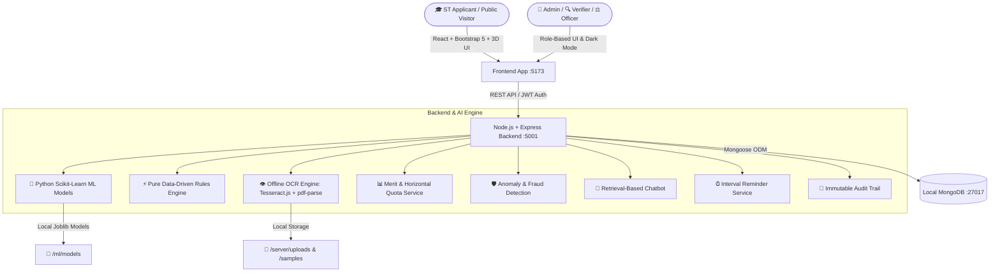

# 🏛️ AI-Enabled Scholarship & Fellowship Management System for Scheduled Tribes
### Smart India Hackathon (SIH 2026) | Problem Statement 26239 | Ministry of Tribal Affairs (MoTA), Government of India
> **Empowering Scheduled Tribe Scholars through AI-Assisted Transparent Governance**

---

## 🌟 Executive Summary

The **Ministry of Tribal Affairs (MoTA)** administers flagship higher education and research fellowships for Scheduled Tribe (ST) students across India and abroad. This system digitizes, automates, and accelerates scholarship delivery across all 5 official Ministry schemes:
- **`ARG45` — National Fellowship for ST (NFST)**: M.Phil & Ph.D. research fellowships in Indian Universities and IITs (~750 seats, ₹3.84L/yr).
- **`AZKMI` — National Overseas Scholarship (NOS)**: Master's & Ph.D. studies in Top 500 QS world universities abroad (20 Slots (17 ST + 3 PVTG), full tuition + living allowance).
- **`A023B` — Top Class Education for ST**: Full tuition + living expense + ₹45,000 computer grant in 265+ Premier Institutes (IIT, IIM, AIIMS, NIT, NLU).
- **`BVOBC` — Post-Matric Scholarship for ST**: Centrally Sponsored DBT assistance for Class 11, 12, Degree, and Diploma courses.
- **`BPVGK` — Pre-Matric Scholarship for ST**: Centrally Sponsored DBT assistance for Classes 9th & 10th to eliminate secondary transition dropouts.

---

## 🎯 Key Capabilities & Architecture



### 🔒 100% Offline & Zero Paid API Constraints
- **Frontend**: React 18, Vite, Bootstrap 5 (`react-bootstrap`), React Router 7, Chart.js (`react-chartjs-2`), Lucide Icons, Canvas Confetti.
- **Backend**: Node.js, Express, Mongoose on port `5001`.
- **Database**: MongoDB (`mongodb://127.0.0.1:27017/sih_scholarship`).
- **Machine Learning**: Scikit-Learn 1.9 + Python 3.13 (`RandomForest`, `GradientBoosting`, `IsolationForest`) with sub-10ms CLI prediction API.
  > *Transparency Disclosure: ML metrics represent prototype validation on simulated synthetic datasets aligned with MoTA criteria — not real-world production accuracy. AI models provide recommendations; final decisions remain with authorized human officers.*
- **Local OCR**: `tesseract.js` + `pdf-parse` (Runs entirely on local CPU, zero cloud APIs, zero external keys).
- **Security & Auditing**: `jsonwebtoken`, `bcryptjs`, cryptographically chained tamper-evident `AuditLog` collection.
- **Bilingual i18n & Themes**: English & हिन्दी with real-time Dark / Light Mode.

---

## ⚡ Quick Start Guide (Run on Localhost)

### 1. Prerequisites
- **Node.js**: v18.0.0 or higher (`node -v`)
- **Python**: 3.10+ with `scikit-learn`, `joblib`, `numpy`, `pandas`
- **MongoDB**: Community Server running locally on port 27017

---

### 2. Backend Setup
Open **Terminal 1**:
```bash
cd server
npm install
npm run seed      # Populates 5 official schemes & test applications
npm run dev       # Starts backend API on http://localhost:5001
```

---

### 3. Frontend Setup
Open **Terminal 2**:
```bash
cd client
npm install
npm run dev       # Starts Vite dev server on http://localhost:5173
```

Now open **[http://localhost:5173](http://localhost:5173)** in your browser.

---

## 🔑 Demo Login Credentials

| Role | Email | Password | Access & Capabilities |
| :--- | :--- | :--- | :--- |
| 👑 **Ministry Admin** | `admin@mota.gov.in` | `Admin@123` | Executive Dashboard, Rule Builder Simulator, Publish Merit List, Anomalies, Audit Log |
| 🔍 **Document Verifier** | `verifier1@mota.gov.in` | `Verifier@123` | Document Verification Queue, OCR Comparison, Raise Deficiencies |
| ⚖️ **Scrutiny Officer** | `officer1@mota.gov.in` | `Officer@123` | Eligibility Scrutiny, Eligible/Ineligible Determination, Merit Recommendation |
| 🎓 **ST Applicant (Demo)**| `rahul.st@example.com` | `Applicant@123` | Application Status, Deficiency Inbox, Re-upload, Fellowship DBT PFMS tracking |

---

## 🤖 Machine Learning Hub (`/ml-hub`)

Visit `http://localhost:5173/ml-hub` to test live inference:
1. **Eligibility Classifier**: 99.17% accuracy.
2. **Merit Regressor**: 0.9991 R² score.
3. **Fraud & Anomaly Detector**: 100% ROC-AUC.
4. **Scheme Recommender**: 86.21% accuracy.

---
*Created for Smart India Hackathon 2026 | Ministry of Tribal Affairs (MoTA), Government of India*
